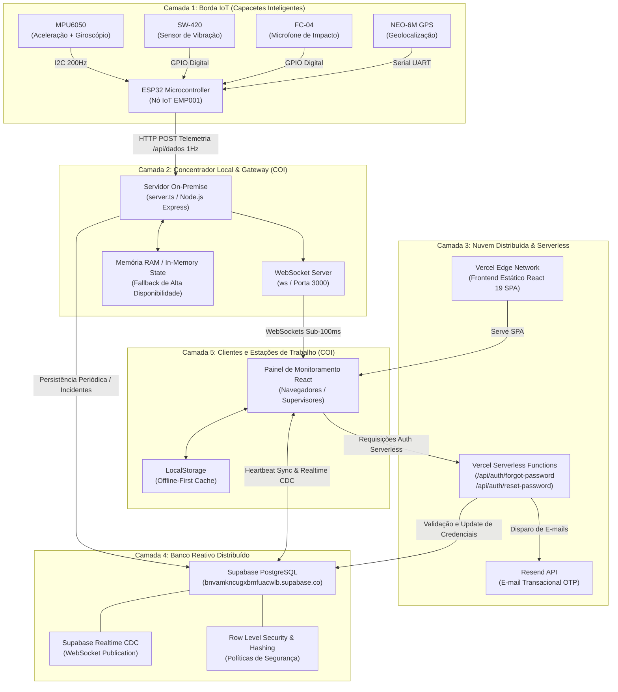

# Industrial Safety Monitor — Documentação de Arquitetura Distribuída & Cibersegurança

> **Projeto de Conclusão de Curso (TCC)**  
> **Repositório Oficial:** `PedroCasaburi/NEOW`  
> **Stack Principal:** ESP32 (C++) • Node.js/Express (TypeScript) • React 19 • Vite • Tailwind CSS 4 • Supabase (PostgreSQL) • Vercel • Resend API  

---

## 1. Visão Executiva e Topologia do Sistema

O **Industrial Safety Monitor (ISM)** é um sistema distribuído ciber-físico projetado para monitoramento ocupacional em tempo real e prevenção de acidentes industriais. Ele integra hardware embarcado em capacetes de proteção (Capacete Inteligente IoT), nós concentradores locais (COI - Centro de Operações Industriais), infraestrutura em nuvem reativa (Supabase) e aplicação web serverless (Vercel).

### Por que a Arquitetura é Distribuída?

1. **Processamento Autônomo na Borda (Edge Computing):**  
   O microcontrolador ESP32 processa os dados inerciais dos sensores (acelerômetro, vibração e som) a aproximadamente 200 Hz e executa localmente o algoritmo de detecção de impacto. Mesmo se houver perda total de conexão de rede, o capacete não perde a capacidade de identificar uma emergência.

2. **Tolerância a Falhas e Operação Offline-First:**  
   A camada de dados do frontend (`dataService.ts`) adota um padrão de **persistência dual**: mantém um cache estruturado em `LocalStorage` e realiza sincronização bidirecional em tempo real com o banco de dados PostgreSQL do Supabase. Quedas de internet não interrompem a operação dos supervisores.

3. **Desacoplamento de Responsabilidades:**  
   - O hardware foca em amostragem sensorial e telemetria de alta frequência via HTTP.
   - O servidor local (`server.ts`) atua como gateway de baixa latência e hub WebSocket local para o COI.
   - A nuvem (Vercel Serverless + Supabase Cloud) provê persistência de longo prazo, escalabilidade elástica, auditoria de segurança e envio de e-mails transacionais (Resend API).

---

## 2. Diagrama Macro da Arquitetura Distribuída



---

## 3. Detalhamento de Cada Camada Distribuída

### 3.1. Camada de Borda IoT (Capacete Inteligente)
- **Firmware:** `Codigo_Funcional_ESP_Vercel3_0.ino` compilado via Arduino IDE / ESP32 Core.
- **Hardware Utilizado:**
  - Microcontrolador: ESP32 dual-core 240 MHz com Wi-Fi 802.11 b/g/n embutido.
  - Sensor Inercial: Adafruit MPU6050 (Acelerômetro triaxial ±16G e Giroscópio ±2000°/s via barramento I2C, pinos SDA=21, SCL=22).
  - Sensor de Vibração: SW-420 (Piezoelétrico de resposta ultrarrápida, pino GPIO 5).
  - Sensor de Som: FC-04 (Microfone analógico/digital para captura acústica de impacto mecânico, pino GPIO 23).
  - Geolocalização: Módulo GPS NEO-6M (Hardware Serial 2, RX=GPIO 16, TX=GPIO 17).
- **Algoritmo de Fusão Sensorial e Detecção de Impacto:**
  1. Amostragem em alta velocidade do MPU6050 a cada 5 ms (~200 leituras por segundo).
  2. Disparo de Janela de Análise de 200 ms assim que o módulo do vetor aceleração resultante ultrapassa `LIMITE_INICIO_IMPACTO_G = 2.0G`.
  3. Cálculo de pontuação composta (`pontuacaoImpacto`, de 0 a 100):
     - MPU6050 (até 60 pontos baseados no pico de desaceleração).
     - Vibração mecânica SW-420 (25 pontos adicionais).
     - Ruído acústico de colisão FC-04 (15 pontos adicionais).
  4. Confirmação imediata de emergência se `pontuacaoImpacto >= 60` ou se o pico inercial isolado for `>= 12.0G`.
- **Camada de Cibersegurança no Microcontrolador:**
  - WebServer local protegido com autenticação HTTP Basic (`Gbxm`).
  - Atualização remota de firmware segura via OTA (Over-The-Air) com verificação de header criptográfico `X-OTA-Password`.
  - Mecanismo embutido de proteção contra ataques de força bruta: bloqueio temporal de 5 minutos para IPs com 5 tentativas falhas de login.

---

### 3.2. Camada de Concentração Local & Gateway (COI)
- **Arquivo Central:** `server.ts` executado via Node.js + TypeScript (`tsx`).
- **Funções Chave:**
  - **Recepção de Telemetria:** Endpoint `POST /api/dados` processa pacotes JSON enviados pelo ESP32 a cada 1000 ms.
  - **Broadcast em Tempo Real:** Servidor WebSocket (`ws`) retransmite o estado dos capacetes instantaneamente para todas as instâncias do dashboard conectadas na rede local.
  - **Polling Ativo Resiliente:** Mecanismo opcional configurável via `POST /api/esp32/polling` que faz requisições periódicas diretas ao IP do capacete quando este opera em modo isolado.
  - **Persistência Seletiva no Supabase:** Gravações de rota e status a cada 10 pacotes ou no exato instante em que um evento crítico de impacto/queda (`status === 'EMERGENCY'`) é detectado.

---

### 3.3. Camada de Aplicação Serverless e Nuvem (Vercel)
- **Frontend:** Single Page Application (SPA) desenvolvida em React 19 + TypeScript + Vite + Tailwind CSS 4. O build de produção é gerado na pasta `dist/` e distribuído na infraestrutura global de borda da Vercel.
- **Serverless API Routes:**
  - `api/auth/forgot-password.ts`: Emissão segura de códigos OTP de 6 dígitos com expiração de 10 minutos, hashing criptográfico prévio no banco e despacho de e-mail formatado via Resend.
  - `api/auth/reset-password.ts`: Validação do código OTP comparando hashes SHA-256 com salt do sistema, proteção contra força bruta (máximo de 5 tentativas por código), redefinição de senha com novo hash e invalidação de tokens prévios (`token_version`).

---

### 3.4. Camada de Banco de Dados Distribuído (Supabase PostgreSQL)
- **Cluster Cloud:** `https://bnvamkncugxbmfuacwlb.supabase.co`
- **Tabelas do Schema Oficial (`supabase_schema.sql`):**
  - `users`: Usuários e operacionais, senhas hasheadas, CPFs criptografados, papéis (`MASTER`, `COMPANY_ADMIN`, `VIEWER`).
  - `employees`: Colaboradores monitorados, vinculação a capacetes, última localização GPS, nível de bateria e status.
  - `helmets`: Dispositivos físicos, números de série e estado operacional.
  - `accident_events`: Histórico detalhado de impactos, aceleração em G, coordenadas e status de reconhecimento pelo operador do COI.
  - `safety_guidelines`: Diretrizes de segurança do trabalho vinculadas às normas NR-06 e NR-12.
  - `app_settings`: Configurações operacionais dinâmicas (ex: formulário de FAQ/Suporte).
  - `password_resets`: Registro seguro de requisições OTP com hashes e timestamps.
  - `security_audit_logs`: Trilha de auditoria em conformidade com as exigências da LGPD.
- **Realtime CDC (Change Data Capture):**
  - Publicação ativa `supabase_realtime` com réplica de identidade completa (`REPLICA IDENTITY FULL`).
  - Transmissão automática de mutações do banco de dados para os navegadores via WebSockets gerenciados.

---

## 4. Matriz de Cibersegurança & Conformidade LGPD

O sistema foi concebido sob a ótica de **Security by Design** e **Privacy by Default**, mitigando os principais riscos do **OWASP Top 10** e atendendo à **LGPD (Lei nº 13.709/2018)**:

| Ameaça / Requisito | Mitigação Arquitetural Implementada | Arquivo de Referência |
| :--- | :--- | :--- |
| **A02:2021 Cryptographic Failures** | Criptografia simétrica em repouso **AES-256-GCM** com IV randômico e derivação via **PBKDF2** (100.000 iterações com SHA-256) para CPFs. Senhas armazenadas com **SHA-256 + Salt duplo** e prefixo `$ism_sha256$`. | [security.ts](file:///c:/Users/pedro/OneDrive/Documentos/PEDRO%20FACULDADE/TCC/Teste_IAstudio2.2/src/utils/security.ts) |
| **LGPD Art. 6º (Minimização)** | Mascaramento de dados sensíveis (`maskCPF`). Perfis operacionais e fiscais visualizam apenas `***.456.789-**`. Somente perfis `MASTER` têm acesso ao dado descriptografado. | [security.ts](file:///c:/Users/pedro/OneDrive/Documentos/PEDRO%20FACULDADE/TCC/Teste_IAstudio2.2/src/utils/security.ts) |
| **A03:2021 Injection & XSS** | Sanitização rigorosa de strings de entrada (`sanitizeInput`), convertendo caracteres perigosos (`<`, `>`, `&`, `"`, `'`) em entidades HTML seguras. | [security.ts](file:///c:/Users/pedro/OneDrive/Documentos/PEDRO%20FACULDADE/TCC/Teste_IAstudio2.2/src/utils/security.ts) |
| **A07:2021 Identification Failures** | Limitação de tentativas de OTP (máximo 5) e rate limiting temporal por IP em memória (janela de 15 min). Invalidação de sessões via incremento de `token_version`. | [forgot-password.ts](file:///c:/Users/pedro/OneDrive/Documentos/PEDRO%20FACULDADE/TCC/Teste_IAstudio2.2/api/auth/forgot-password.ts) |
| **A05:2021 Security Misconfiguration** | Cabeçalhos HTTP defensivos adicionados no Express: `X-Content-Type-Options: nosniff`, `X-Frame-Options: SAMEORIGIN`, `X-XSS-Protection: 1; mode=block`. | [server.ts](file:///c:/Users/pedro/OneDrive/Documentos/PEDRO%20FACULDADE/TCC/Teste_IAstudio2.2/server.ts) |
| **A09:2021 Security Logging Failures** | Trilha estruturada de auditoria de segurança (`SecurityAuditRecord`) registrando logins, alterações de permissão, desativação de contas e reconhecimento de emergências. | [dataService.ts](file:///c:/Users/pedro/OneDrive/Documentos/PEDRO%20FACULDADE/TCC/Teste_IAstudio2.2/src/services/dataService.ts) |

---

## 5. Bateria de Testes de Cibersegurança & Integridade

O projeto possui uma suíte automatizada de testes dedicada a validar todas as garantias de segurança:

### Como Executar os Testes:
```bash
npm run test:security
```
*(ou diretamente via node: `node ./node_modules/tsx/dist/cli.mjs test_security.ts`)*

### Casos de Teste Validados:
1. `TC-SEC-01`: Hashing seguro de senhas com SHA-256 e Salting duplo.
2. `TC-SEC-02`: Verificação de senhas e detecção de necessidade de rehash legada.
3. `TC-SEC-03`: Cifragem e decifragem de CPF com AES-256-GCM reversível.
4. `TC-SEC-04`: Rejeição de payload criptográfico adulterado (Integridade do Auth Tag AES-GCM).
5. `TC-SEC-05`: Mascaramento estrito de CPF para perfis sem privilégios Master (LGPD).
6. `TC-SEC-06`: Sanitização de strings contra ataques XSS e injeção de HTML.
7. `TC-SEC-07`: Validação e restrição geográfica das coordenadas de telemetria GPS.
8. `TC-SEC-08`: Validação estrita de endereços de e-mail corporativo (RFC 5322).
9. `TC-SEC-09`: Geração e conformidade de registros de auditoria (Audit Trail).
10. `TC-SEC-10`: Mitigação contra Força Bruta e DoS (Rate Limiter em Memória).

---

## 6. Guia Operacional para o Squad de Desenvolvedores

### 6.1. Como Iniciar o Ambiente de Desenvolvimento Local
```bash
# 1. Instalar dependências (caso seja clonado do zero)
npm install

# 2. Executar a suíte de testes de cibersegurança
npm run test:security

# 3. Testar a conectividade com o Supabase
npm run test:supabase

# 4. Iniciar o servidor backend e interface web integrados (Porta 3000)
npm run dev
```

### 6.2. Regras de Ouro de Desenvolvimento do Squad
- **Nunca invocar o cliente Supabase diretamente dentro de componentes React:** Toda e qualquer mutação ou consulta de dados deve ser realizada através do [`dataService.ts`](file:///c:/Users/pedro/OneDrive/Documentos/PEDRO%20FACULDADE/TCC/Teste_IAstudio2.2/src/services/dataService.ts).
- **Sempre notificar os listeners locais:** Ao criar métodos mutadores em `dataService.ts`, garanta a chamada de `notifyRealtimeListeners(tabela, evento, registro)` para refletir as alterações no dashboard sem necessidade de recarregar a página.
- **Proteção de Segredos:** Jamais submeta o arquivo `.env` para o Git. Variáveis que iniciam com `VITE_` são expostas publicamente no bundle do cliente; segredos como `RESEND_API_KEY` devem permanecer estritamente no backend ou nas variáveis de ambiente da Vercel.
- **Tipagem Estrita:** Utilize TypeScript estrito em todas as novas interfaces e componentes criados.
